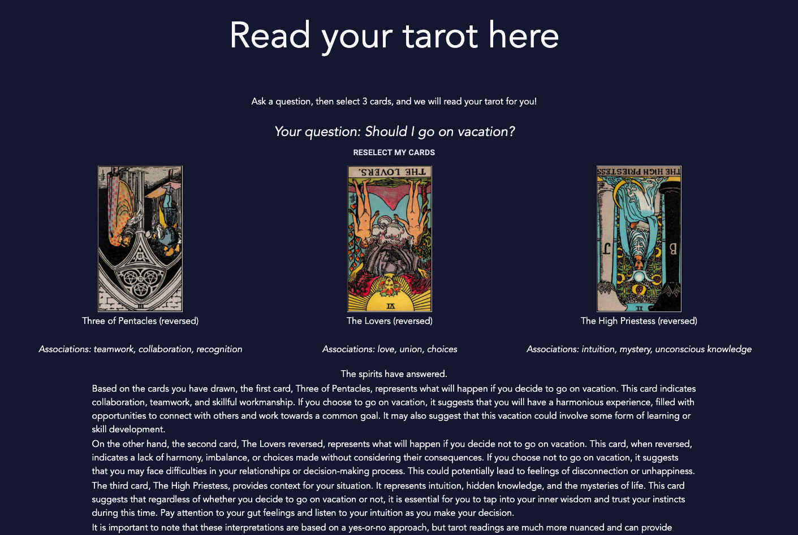

# Tarot Reader Using ChatGPT

An app for people to simulate the experience of a tarot reading -- without a deck or a reader.

This was inspired by tarot card reading night where we discovered that ChatGPT was really not bad at interpreting cards for us.

# Overview

Tarot reading is the practice of divining wisdom through pulling and interpreting Tarot cards. Typically, the one seeking guidance shuffles and pulls cards out themself, and an expert interprets the selection and orientation of cards. Photos of the cards can be found in `assets/tarot_card_fronts`, and descriptions are saved in `assets/tarot_card_list.json`. Note that the json file was almost entirely generated by ChatGPT.

In this app, cards are selected (randomly generated) when the user clicks "Read my fortune". The user is then presented with the 3 cards they've chosen along with the associations with the card, while in the backend, a request is sent to the OpenAI Assistant API to interpret the cards in the context of the user's question. When we receive the response, it is rendered on the page.
